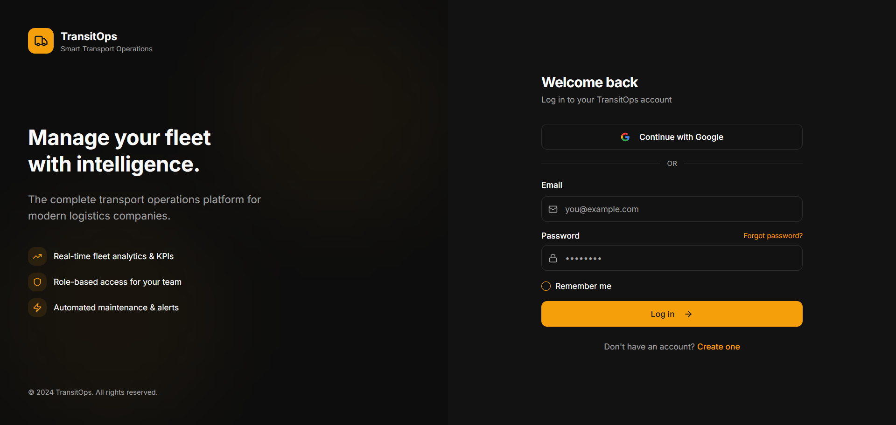
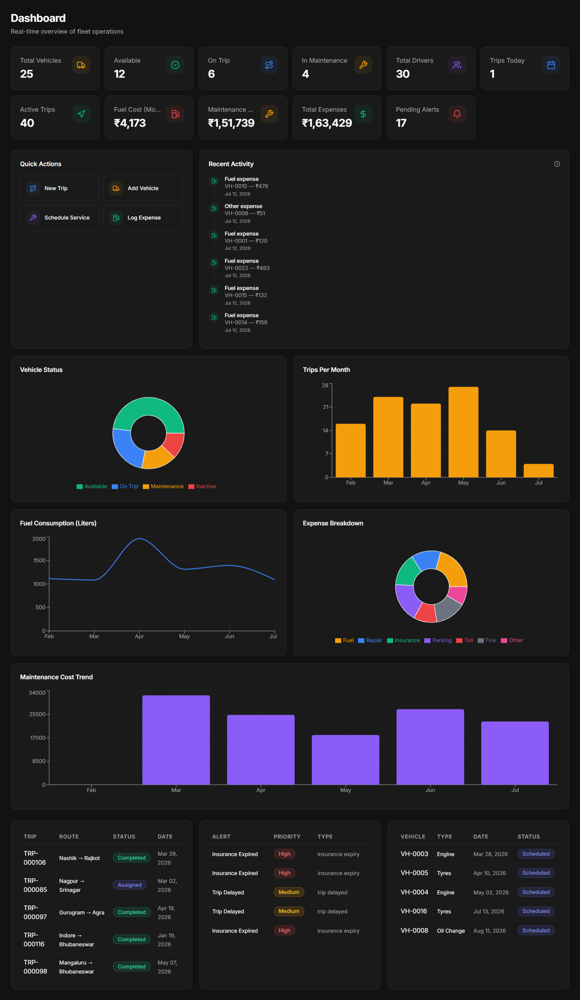
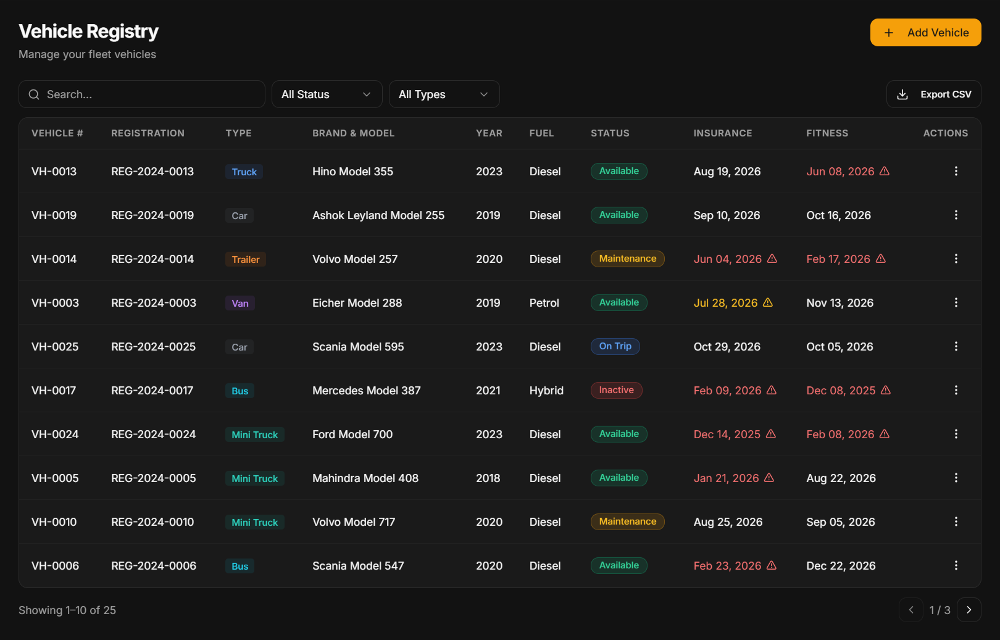
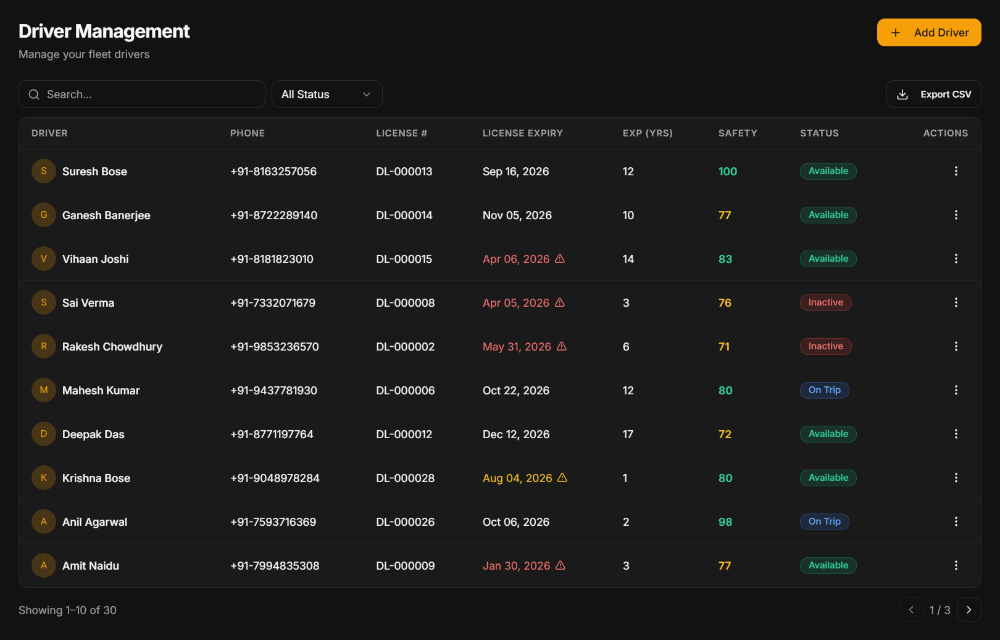
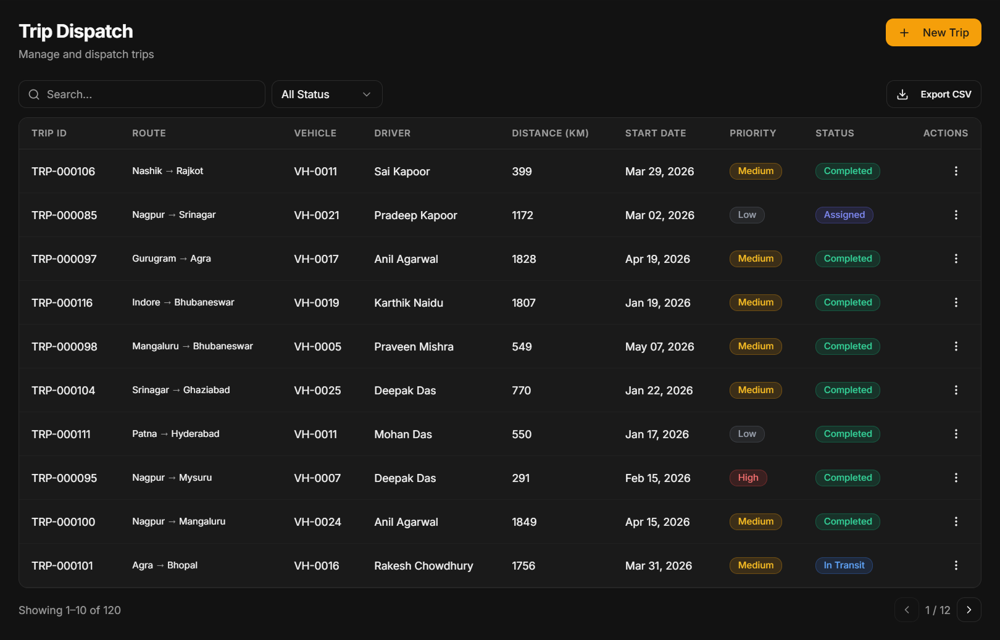
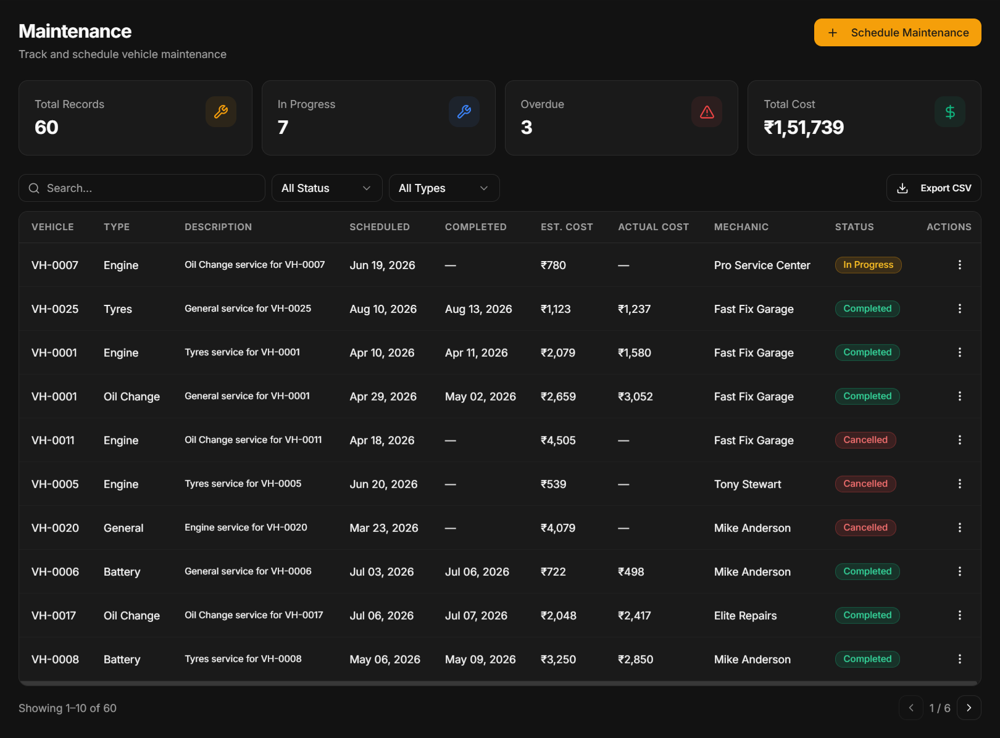
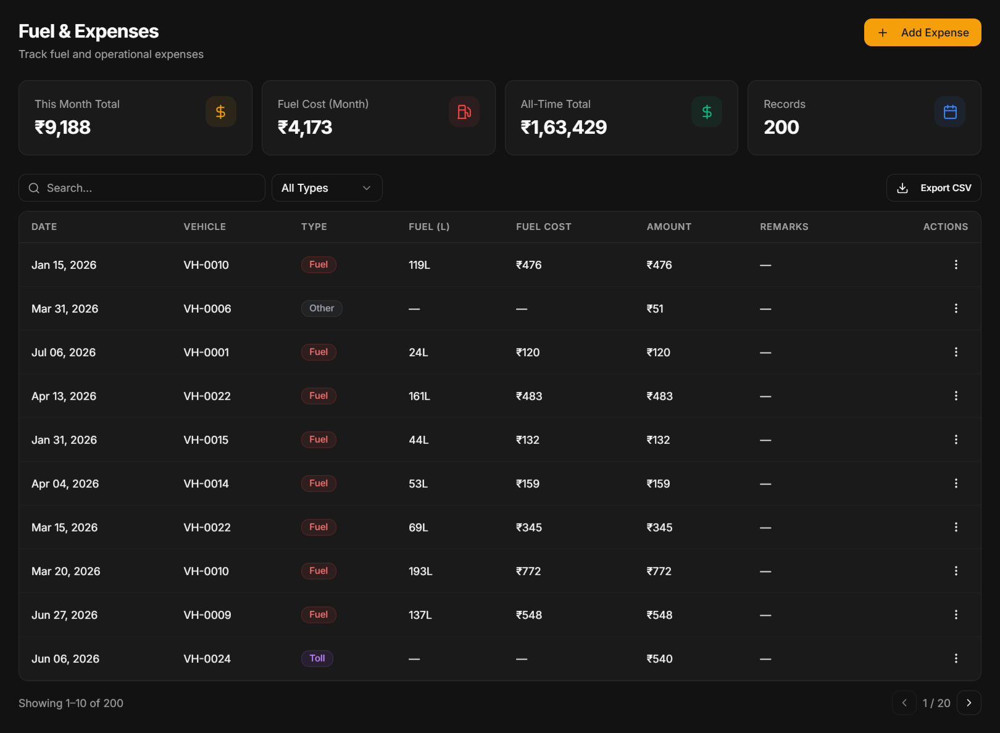
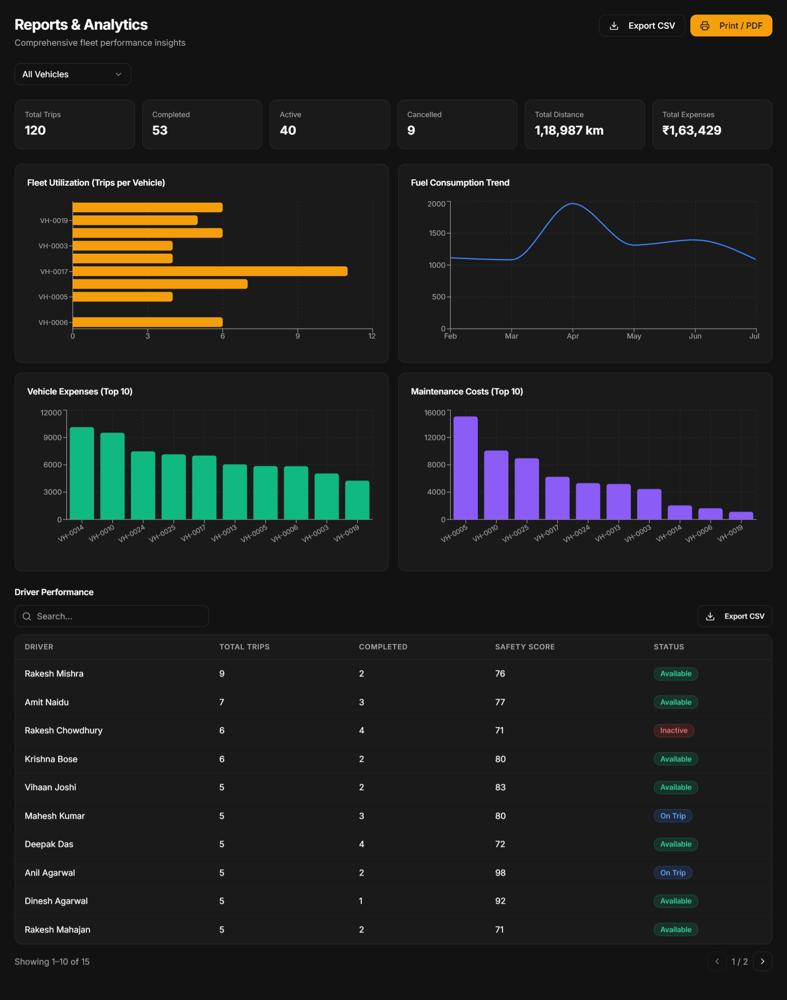
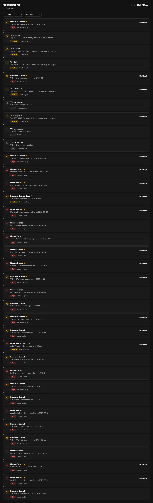

# Oddo--TransitOps---Smart-Transport-Operations-Platform
# 🚛 TransitOps – Smart Transport Operations Platform

> **A centralized transport management platform that digitizes vehicle operations, driver management, trip dispatch, maintenance, fuel tracking, expense management, and operational analytics for logistics organizations.**

<p align="center">


</p>

---

# 🌐 Live Demo

### 🚀 Try the Application

**🔗 https://dainty-transit-ops-flow.base44.app/**

---

# 📖 About the Project

TransitOps is a modern Smart Transport Operations Platform developed to streamline fleet and logistics management. It replaces traditional spreadsheet-based workflows with an intelligent centralized system that manages vehicles, drivers, trips, maintenance, fuel consumption, expenses, and operational analytics.

The platform enables organizations to efficiently monitor fleet operations, ensure driver compliance, reduce maintenance delays, optimize resource utilization, and gain actionable insights through interactive dashboards.

---

# ❗ Problem Statement

Many logistics companies still rely on manual spreadsheets and paper logbooks to manage transport operations. This often results in:

- Scheduling conflicts
- Underutilized vehicles
- Missed maintenance schedules
- Expired driver licenses
- Poor expense tracking
- Lack of operational visibility
- Inefficient fleet utilization

TransitOps addresses these challenges by providing an integrated digital platform for end-to-end transport operations management.

---

# 💡 Our Solution

TransitOps centralizes all transport-related activities into a single intelligent platform where organizations can:

- Register and manage vehicles
- Manage driver records and compliance
- Dispatch trips efficiently
- Track vehicle maintenance
- Record fuel consumption
- Monitor operational expenses
- Generate insightful analytics
- Receive automated alerts for important events

---

# ✨ Features

## 🚗 Vehicle Registry

- Register vehicles
- Track vehicle status
- Monitor insurance expiry
- Monitor fitness certificate expiry
- Vehicle assignment
- Vehicle availability tracking

---

## 👨‍✈️ Driver Management

- Driver profiles
- License management
- License expiry alerts
- Safety score monitoring
- Vehicle assignment
- Driver availability tracking

---

## 🚚 Trip Dispatch

- Create trips
- Assign vehicles
- Assign drivers
- Trip status tracking
- Active trip monitoring
- Trip history

---

## 🔧 Maintenance Management

- Schedule maintenance
- Maintenance history
- Service tracking
- Maintenance cost management
- Maintenance reminders

---

## ⛽ Fuel & Expense Management

- Fuel logs
- Vehicle-wise expenses
- Expense categories
- Monthly expense summaries
- Fuel consumption tracking

---

## 📊 Dashboard & Analytics

- Fleet overview
- Vehicle utilization
- Fuel consumption trends
- Expense analysis
- Maintenance trends
- Active trips
- Operational KPIs

---

## 🔔 Notification Center

- Driver license expiry alerts
- Vehicle insurance expiry alerts
- Maintenance reminders
- Vehicle availability alerts
- Expense notifications

---

# 👥 User Roles

## Fleet Manager

- Manage fleet
- Register vehicles
- Monitor operations
- Schedule maintenance
- View reports

---

## Driver

- View assigned trips
- Update trip status
- Access assigned vehicle information

---

## Safety Officer

- Monitor driver compliance
- Verify licenses
- Track safety scores
- Review regulatory requirements

---

## Financial Analyst

- Monitor expenses
- Analyze fuel consumption
- Review maintenance costs
- Generate financial reports

---

# 🔄 Application Workflow

```text
Vehicle Registration
        │
        ▼
Driver Registration
        │
        ▼
Trip Creation
        │
        ▼
Vehicle & Driver Assignment
        │
        ▼
Trip Execution
        │
        ▼
Fuel Logging
        │
        ▼
Maintenance Tracking
        │
        ▼
Expense Recording
        │
        ▼
Reports & Analytics
```

---

# 📸 Application Screenshots

## 🔐 Login



---

## 📊 Dashboard



---

## 🚗 Vehicle Registry



---

## 👨‍✈️ Driver Management



---

## 🚚 Trip Dispatch



---

## 🔧 Maintenance



---

## ⛽ Fuel & Expense Management



---

## 📈 Reports & Analytics



---

## 🔔 Notifications



---

# ⚙️ Business Rules

The platform automatically enforces critical operational rules:

- Vehicles under maintenance cannot be assigned to trips.
- Drivers with expired licenses cannot be assigned.
- Vehicles with expired insurance become unavailable.
- Drivers already assigned to active trips cannot receive another assignment.
- Vehicles already on active trips cannot be reassigned.
- Dashboard metrics update automatically after every operational event.
- Fuel and maintenance costs are reflected in analytics.

---

# 📊 Dashboard Metrics

The dashboard provides real-time operational insights including:

- Total Vehicles
- Available Vehicles
- Vehicles on Trip
- Vehicles Under Maintenance
- Total Drivers
- Active Trips
- Monthly Fuel Cost
- Monthly Maintenance Cost
- Total Operational Expenses
- Pending Alerts

---

# 🛠 Technology Stack

| Category | Technology |
|----------|------------|
| Platform | Base44 |
| Frontend | Base44 UI Components |
| Backend | Base44 Backend |
| Database | Base44 Managed Database |
| Authentication | Base44 Authentication |
| Deployment | Base44 Cloud |

---

# 📂 Project Structure

```
TransitOps
│
├── README.md
├── screenshots/
│   ├── login.png
│   ├── dashboard.png
│   ├── vehicles.png
│   ├── drivers.png
│   ├── trips.png
│   ├── maintenance.png
│   ├── expenses.png
│   ├── reports.png
│   └── notifications.png
│
└── Source Code
```

---

# 📋 Sample Data

The application includes realistic sample data for demonstration:

- 🚗 25 Vehicles
- 👨‍✈️ 30 Drivers
- 🚚 120 Trips
- 🔧 60 Maintenance Records
- ⛽ 150 Fuel Logs
- 💰 200 Expense Records

---

# 🚀 Future Enhancements

- AI-based Route Optimization
- Predictive Maintenance
- GPS Tracking
- Driver Mobile Application
- IoT Vehicle Integration
- Carbon Emission Monitoring
- Fuel Consumption Prediction
- Multi-company Support
- Advanced Analytics
- Real-time Fleet Monitoring

---

# 👩‍💻 Team

| Name | Role |
|------|------|
| Amruta Kadali | Team Leader |
| Team Member 2 | Developer |
| Team Member 3 | Developer |
| Team Member 4 | Developer |

---

# 📝 Evaluation Guide

To review the application:

1. Open the live application using the link above.
2. Explore the Dashboard for an overview of fleet operations.
3. Navigate through Vehicle Registry, Driver Management, Trip Dispatch, Maintenance, Fuel & Expense Management, and Reports.
4. Review the analytics dashboard and charts.
5. Verify role-based access and business rule enforcement.

---

# ⭐ Why TransitOps?

TransitOps transforms traditional fleet management into a centralized digital platform by integrating fleet operations, driver compliance, trip dispatch, maintenance scheduling, expense management, and analytics into a single intuitive system.

By automating business rules and providing real-time operational insights, TransitOps helps logistics organizations improve efficiency, reduce downtime, ensure compliance, and make data-driven decisions.

---

# 📄 License

This project was developed for the **Odoo Hackathon** as part of the **TransitOps – Smart Transport Operations Platform** challenge.

---

## ⭐ If you found this project interesting, don't forget to star the repository!
